# Yaku

* **Track:** _Especialización UX Design_
* **Curso:** _Conociendo los negocios_
* **Unidad:** _Lecciones básicas de negocios_
* **Alummnas:** _Nombres:_

                * Alexandra Calderón Chumbes
                * Silvia Puente de la Vega

***

## Reto

### Nuevo Banco digital para millenials 

El Banco del País es uno de los bancos más importante de tu país. Es una institución de muchos años y actualmente está pasando por un proceso de transformación digital. Como parte de este proceso, han implementado un área de innovación que quiere llegar de una mejor manera a los usuarios más jóvenes. Por lo que, inspirados en Nequi, Nubank y Simple se han propuesto crear un banco 100% digital dirigido para millenials. Es tu primera semana en la empresa y te han pedido que te encargues de esa investigación. 

### Objetivos del reto

#### Tu reto ahora es:

* Identificar quiénes son los stakeholders de tu proyecto
* Planear una reunión de kick * off detallando
* Quiénes deberían estar presentes
* Qué les preguntarías a los presentes
* El product manager encargado te ha pedido además que para la sesión de kick * off vengas con un Business Model Canvas     (hipotético) del producto "Banco 100% digital", para que así los stakeholders puedan validar o invalidar las hipótesis    o pedirte que te enfoques en validar alguna hipótesis durante la investigación.

Además, te piden que llegues a la reunión de kick * off con un plan propuesto de investigación, en el que detalles qué actividades de investigación, según tu criterio se deberían realizar, sustentando el por qué propones c/u de esas actividades.

## Consideraciones

* Este reto fue realizado en parejas.

* En la colaboradores, puede encontrar quiénes hemos trabajado en este reto.

* Dentro de este archivo `README.md` está todo el desarrollo del trabajo, el proceso de investigación, la solución del reto y nuestras concluciones y feedbacks. 

* Dentro de la carpeta `assets` se encuentra la carpeta `img` donde podrá encontrar las imágenes utilizadas en el proyecto.

## Flujo de trabajo

Empezamos analizando el reto, por lo cual decidimos hacer una investigación previa, armando los BMC de cada uno de los bancos modelo (Nequi, Nubank y Simple); también investigar sobre las característcas de un millennial y la relación de este con la banca. Luego, hicimos un Plan de Research, un modelo de Entrevista y el BMC de nuestro nuevo banco, basándonos en lo encontrado en la investigación previa. Después, pasamos a las **entrevistas a profundidad y formularios con usuarios reales**. Con la data obtenida, se realizó un Mapa de Afinidad, en el cual se encontró que a los millennials no le gusta perder el tiempo, no les gustan los papeleos y formalidades en la banca, sí usan banca por Internet y están interesados en **un banco que sea eco friendly**. Con todo esto, pasamos a prototipar. Primero hicimos el prototipo en papel, se testeó con usuarios e iteró en base a ello. Seguido de esto, realizamos el **prototipo de alta fidelidad** digitalizado e interacctivo, el cual también se testeó y se hicieron algunas iteraciones. Este nuevo prototipo se volvió a testear y obtuvimos un mejor feedback para una siguiente mejora.

 **Link de Google Drive:** 

    [Carpeta de trabajo en Google Drive](https://drive.google.com/drive/folders/1*bYeooGSpoq1siLef6rUcQLmMvYNw3iA?usp=sharing).

## Investigación previa

En el reto presentado se nos indica que tomemos inspiración de Nequi, Nubank y Simple, bancos 100% digitales que han sido un éxito.

### Nequi

Nequi surge como una iniciativa de innovación de Bancolombia, que cree en esta plataforma y la apoya, pero es una nueva alternativa que tiene vida propia: su propio equipo, estructura, metodologías, tecnología y espacio de trabajo.

#### Business Model Canvas

1. **Customer Segments:**
	          * Millenials.
            * Otros bancos asociados.

2. **Customer Relationship:**
            * Automatización de la Banca (Flexibilidad).
            * Social Media.

3. **Channels:**
            * App y Web.

4. **Value Proposition:**
            * Costo cero por creación de cuenta.
            * Facilidad de acceso.
            * 5 formas de pagar (envíos, pagar por PSE, con código QR en un datáfono, por recarga de otro usuario, por recarga en efectivo).
            * Giros desde tu Banca por app y web, sin costo.
            * Tres herramientas para que puedas manejar la plata a tu propio      ritmo.
            * Los bolsillos te sirven para separar la plata (Agenda monetaria)
            * Metas de ahorro.
            * Guardadito: mini montos, fáciles de usar que Nequi te pone a la  vista. 
5. **Key Partners:**
            * Bancolombia (permite sacar tu dinero sin costos, ni comisiones).
            * Bancos asociados (se cobra el 1% del movimiento).

6. **Key Activities:**
            * Actualizar su plataforma.
            * Mantenimiento de su plataforma.
            * Investigaciones constantes para conocer al cliente colombiano y paraguayo y sus necesidades respectiamente.
            * Servidores.
            * Hacer promociones y eventos. 
            * Mantener relación con el Estado.
            * Mantener la seguridad del banco.

7. **Key Resources:**
	          * Físicos: Almacenes, oficinas, instalaciones, maquinaria, etc.
	          * Intelectual: Patente, marca, etc.
	          * Recursos humanos.
	          * Finanzas: mercado, expansión.
	          * Convenios.

8. **Cost Structure:**
	          * Recursos Físicos.
	          * Recursos Humanos.
	          * Convenios.
	          * Patente, marca, etc.
            * Permisos.
            * Pubilicidad.
            * Investigación.
            * Expansión.
            * Maquinarias.

9. **Revenue Stream:**
	          * Enviar dinero de tu cuenta Nequi a bancos (salvo Bancolombia) tiene costo.
	          * Quitarle los topes a tu cuenta.

### Nubank

Nubank es una empresa de servicios financieros que nació en Sao pablo, Brasil en mayo de 2016. Nubank actúa como operador de tarjetas de crédito, por lo que su producto es una tarjeta Mastercard.

#### Business Model 

1. **Customer Segments:**

            * Millenials brasileños
            * Usuarios tecnológicos en Brasil.
            * Bancos y empresas asociadas.

2. **Customer Relationship:**

            * Automatización de la Banca (Flexibilidad).
            * Social Media.

3. **Channels:**

           * App y Web.

4. **Value Proposition:**
           * Facilidad de acceso.
           * No hay costo de creación de cuenta ni de mantenimiento.
           * Obtener la tarjeta morada de Mastercard o Nubank Mastercard, la cual es aceptada en más de 30 millones de establecimientos en todo el mundo y que también le da acceso a los beneficios de la bandera   Mastercard.
           * Nunbank Rewards, sistema de gamification con el cuál cada punto equivale a un real. Tus puntos sirven para pagar otros servicios asociados como Uber, Netflix, etc. y/o borrar historiales de movimientos.
          
5. **Key Partners:**

           * Sequoia Capital, Kaszek Ventures, Tiger Global Managment, Founders Fund, Goldman Sachs, QED Los inversores y DST Global.

6. **Key Activities:**

           * Actualizar su plataforma
           * Mantenimiento de su plataforma
           * Servidores
           * Hacer promos y eventos 
        
7. **Key Resources:** 

	         * Oficinas.
	         * Maquinarias y Servidores.
	         * Recursos humanos.
	         * Patentes.
           * La plataforma.

8. **Cost Structure:**
	         * Oficinas
	         * Maquinarias y Servidores
	         * Recursos humanos
	         * Patentes
	         * Convenios
        

9. **Revenue Stream:**
	         * Cuando el cliente realiza una compra con su tarjeta, recibe del establecimiento, a través de la bandera Mastercard, un pequeño porcentaje de ese valor.
           * Cuando el cliente escoge por financiar parte o el total del valor de su factura, recibe intereses, incluso por debajo del mercado, sobre el valor que se financió.

### Simple

El desarrollo de esta startup ‘fintech’ es un ejemplo de éxito dentro del sector: creación de un banco minorista con operaciones exclusivas online y, principalmente, vía móvil. Además, con su compra por parte de BBVA, Simple también se ha convertido en un referente de las estrategias de innovación abierta.

#### Business Model Canvas

1. **Customer Segments:**
	        * Millenials.
          * Otros bancos asociados.

2. **Customer Relationship:**
          * Automatización de la Banca (Flexibilidad).
          * Social Media.

3. **Channels:**
          * App y Web.

4. **Value Proposition:**

          * Facilidad de acceso
          * 0 Comisiones, no cobra por honorarios.
          * Giros desde tu Banca por app y web, sin costo.
          * Simple proporciona todo lo demás(Los fondos en su cuenta Simple están en manos de uno de nuestros bancos asociados, The Bancorp Bank o Compass Bank, Member FDIC), incluida la tarjeta Visa.

5. **Key Activities:**
           
           * Oficinas.
	         * Maquinarias y Servidores.
	         * Recursos humanos.
	         * Patentes.
           * La plataforma.

6. **Key Partners:**

           * BBVA.
           * Bancos y empresas asociadas.

7. **Key Resources:**

	         * Oficinas.
	         * Maquinarias y Servidores.
	         * Recursos humanos.
	         * Adtualizar la plataforma.
           * Investigar su mercado.
 
8. **Cost Structure:**

	        * Oficinas.
	        * Maquinarias y Servidores.
	        * Recursos humanos.
	        * Patentes.
	        * Convenios.

9. **Revenue Stream:**

	        * Comparten intereses con otros bancos.
	        * Cuando desliza su tarjeta de débito, el comerciante paga una tarifa   de servicio (llamada intercambio) al banco emisor. Nuestros socios    dividen esto con nosotros.
	        * Si usa su tarjeta Simple internacionalmente, Visa incluirá una        tarifa de Evaluación de Servicio Internacional (ISA) de hasta el 1%   del monto total de la transacción.

### Millennials

* En los próximos cinco años, los millennials la generación de jóvenes que nació entre 1981 y 2000 supondrá el 75% de la fuerza laboral en el mundo. Con más de 80 millones de personas en Estados Unidos, otros 51 millones en Europa y unos 170 millones estimados a nivel global, la nueva generación de consumidores se está transformando en el foco de estrategias y campañas publicitarias de empresas de los más diversos rubros.

* La banca no ha quedado ajena a este fenómeno y, actualmente, lucha por atraer y fidelizar a un grupo que rompe con los paradigmas de las generaciones anteriores, estableciendo nuevos hábitos de consumo y formas de relacionarse con las empresas.

* Un estudio de la empresa fabricante de software de notificaciones financieras, Latinia, reveló que el 40% de los millennials nunca ha pisado una sucursal bancaria y que la mayoría no está familiarizado con las funciones que cumplen las instituciones financieras, pues muchos ven ajenos conceptos como tasas, intereses y créditos. Incluso, el mismo estudio destaca que el 53% de los encuestados no piensa que su banco sea diferente al de los demás, por lo que uno de cada tres estaría dispuesto a cambiar de entidad fácilmente.

* Otro de los resultados del análisis refleja la afinidad de los millennials con la tecnología y los servicios de mensajería instantánea. La principal vía de comunicación entre estas instituciones y sus clientes son las páginas web y las aplicaciones que han desarrollado los bancos para smartphones , donde una buena o mala aplicación móvil puede sellar la imagen de la empresa frente a sus clientes más jóvenes. Entre los millennials chilenos, la red preferida por los usuarios es Facebook por sobre otras similares, como Twitter. Por cada usuario en esta última hay dos que prefieren utilizar Facebook, para enterarse de noticias y servicios disponibles en su banco.

* **Apuesta digital:** Este cambio de escenario para la banca necesita de nuevas estrategias para lograr el éxito, en un mercado donde los clientes van de una institución a otra más fácilmente que antes. Por lo mismo, las prioridades han cambiado y también las inversiones en los distintos servicios que ofrecen a esta generación.

* **Que sea transparente:** Los Millennials quieren saber: ¿Qué van a pagar? ¿Cómo y cuándo lo van a pagar? ¿Qué productos le quieren vender? ¿El banco les está tratando de forma justa? ¿Qué representa el banco? ¿Tiene valores sociales? 

* **Quiero ser único:** Tienen un alto sentido de individualidad. Quieren consumir productos y recibir servicios completamente alineados a sus gustos y necesidades.

* **Quiero más que dinero:** Quieren más que incentivos monetarios. Los Millennials buscan valor en la “experiencia” completa que les brinda el banco de principio a fín. Toda la trayectoria de la experiencia del cliente importa.

* **Lo quiero digitalizado:** Los procesos manuales son reliquias del pasado y no son compatibles con las expectativas de la generacion Millennial. La experiencia completa del cliente debe estar digitalizada y automatizada.

* **Quiero evolucionar:** La lealtad, los gustos y las preferencias son elementos volátiles en constante evolución. Cambiar de proveedores es fácil, y si pueden, lo harán.

* **Lo que digan mis amigos:** Confían en personas, no en compañías. Escuchan las recomendaciones de sus amigos, de conocidos, o “influencers” por redes sociales. Cada cliente es un embajador de la marca.

* **Quieren acceso inmediato y fácil:** A los productos y servicios que necesitan. Tienen baja tolerancia a los tiempos de espera y procesos largos. Lo quiero rápido y fácil.

* El 71%, Recomienda sus marcas favoritas de forma activa 
* El 47%, ha criticado una marca por Internet
* El 86%, comparte sus preferencias de marca por Internet. 

* Apoyan más las leyes ambientales estrictas, con mayor probabilidad de contribuir a la actividad humana ante el Calentamiento Global.

* Están a favor de las políticas amigables con el medio ambiente como el desarrollo de energía más verdes e incentivos para usar carros híbridos, bicicletas o el transporte colectivo. 

* La población que son considerados como “jóvenes adultos” está de acuerdo a pagar más por productos socialmente responsables y desean trabajar para una empresa que involucre estos valores a su cadena de producción y a la imagen misma de la empresa.

* Expandir su conocimiento sobre sostenibilidad, productos y servicios amigables con el medio ambiente.

* Recopilar información de productos y servicios para poder tomar decisiones de compra, influenciadas también la opinión de otros consumidores.

* Dar importancia a la imagen responsable de las organizaciones.

* La creación de políticas verdes, como el fomento de las energías limpias o el transporte público en sus países.

* Entender que el producto con carácter social y ambiental tiene un coste algo mayor.

### Conclusiones

#### Respecto a los bancos

Estos tres bancos tienen una llegada al cliente muy particular, se dirigen a ellos con mucha confianza y sin formalidades. Además de esto, son sencillos de usar y aún así toman todas las medidas de seguridad que un banco necesita. 

Respecto al modelo de negocio, se ve que: ninguno de ellos cobra por creación de cuenta y/o mantenimiento. Tienen reglas como ser residente del país en donde ellos están y en caso de Nubank y Simple ser mayor de 18 años, mientras Nequi acepta usuarios de 15 años a más. 

Los mayores ingresos los obtienen con los bancos asociados a ellos respectivamente. También con pequeños cobros no muy sentidos en sus clientes.

#### Respecto a los millennials

Son una generación revolucionaria. Están dispuestos al cambio. Son casi 100$ digitales, pero aún así se preocupan por el cuidado ambiental. No les gusta perder el tiempo, quieren lo rápido, fácil y accesible. Los papeleos no son lo suyo, y aún menos las formalidades. Quieren saberlo todo y no sentirse engañados por nadie. 

Ellos están siendo un verdadero dolor de cabeza para los bancos. Ya que, no les gusta ir a un banco físico ¿To es mejor digital no? Sí, efectivamnte así es para los millenials.

Son muy eco friendly, nacieron para vivenciar el cuidado al medio ambiente, tanto sea en el su trabajo, lo que consumen o usa, y en su vida y cuidado personal.

### Creación e Ideación del banco 100% digital

Luego de la investigación previa, armamos nuestro BMC (Business Model Canvas). El resultado fue el siguiente:

#### BMC

##### Banco 100% Digital “Yaku”

1. **Customer Segments:**

	          * Millenials y Z's peruanos.
            * Otros bancos asociados (mayoría de bancos de la ciudad).

2. **Customer Relationship:**

            * Automatización de la Banca (Flexibilidad).
            * Social Media (Web).

3. **Channels:**

           * App y Web.

4. **Value Proposition:**

           * Ser un banco con conciencia social que apoye al medio ambiente.
           * Ser un banco accesible para todos, también para persoas con habilidades especiales.
           * Facilidad de acceso
           * 0 Comisiones, no cobra por honorarios.
           * Giros desde tu Banca por app y web, sin costo.
           * Permite hacer transacciones (sin costos)
           * Tarjeta especial opcional (hecha con material reciclable), la cual será otorgada por el Banco del País.
           * Puntos por actividades a favor de un ambiente sostenible.
           * Cheques virtuales, QR.
           * Dentro de la aplicación tener un modo de Control de cuenta que tenga: 
                                        * Agenda monetaria, (registro de movimiento)
                                        * Metas (A cuánto dinero estás de lograr algo).
                                        * Guardadito (monedero).
                                        * Departamento propio, estudios y viajes.                                       
           * Confirmación de movimientos por mensajes de texto.

5. **Key Activities:**

           * Actualizar la plataforma.
           * Mantenimiento de la plataforma.
           * Pago de servidores.
           * Asociaciones con otros bancos.
           * Asociaciones con empresas y emprendimientos eco friendly.
           * Investigaciones frecuentes para conocer al usuario y el mercado.
           * Pago de impuestos y permisos.

6. **Cost Structure:**

	         * Oficinas.
	         * Maquinarias y Servidores.
	         * Recursos humanos.
	         * Patentes.
	         * Convenios.
	         * Promociones
           * Impuestos y permisos.

7. **Key Partners:**

           * Banco del País.
           * Bancos y empresas acosiadas.
           * Empresas y emprendimientos eco friendly.
           * Servicios públicos y privados. 

8. **Key Resources:**  

	        * Oficinas.
	        * Maquinarias y Servidores.
	        * Recursos humanos.
          * Servidores, Internet, etc.
          * Plataforma.

9. **Revenue Stream:**

	        * Por cobro único de permiso para retirar dinero en otro lugar al tu residencia.
	        * Cobro por usar el dinero de ahorro de tus metas para otro propósito.
	        * Cobro por uso en el extranjero (transacciones, etc.).
          * Cobro por movimientos en bancos asociados, exceptuando al Banco del País, tendrán un cobro de 1%, cuál se repartirá.

**Link de carpeta en Google Drive** 

#### Nuestros de Stakeholders

* Los millenials : jóvenes nacidos entre 1980 y 1996 y los Zs
* CEO.
* Gerente de Riesgos.
* Gerente de Marketing.
* Gerente de RRHH.
* Gerente de IT.
* Jefe de innovación.
* Equipo digital:
      - Ux-design 
      - UI-design 
      - Front-end developer y 
      - Back-end developer
* Regulador estatal
* Community Manager
* Gerente de Agencia
* Jefe de ventas
* Ejecutivo de call center
* Auditor
* Bancos asociados a la red de Banca Digital.

#### Plan de Research

[Documento de Google](https://docs.google.com/document/d/1ezkSz7FM5XOsGMUFTPMEkachW6FAVkFKVsyscQ6JpPw/edit?usp=sharing).

#### Planteamiento de Research para la solución a un banco 100% digital en Perú

##### Realizado por: Silvia Puente de la Vega y Alexandra Calderón Chumbes

##### Stakeholders: **Lista de stakeholders**

##### Fechas de revisión: Lunes 26 de febrero

El Banco del País es uno de los bancos más importante de tu país. Es una institución de muchos años y actualmente está pasando por un proceso de transformación digital. Como parte de este proceso, han implementado un área de innovación que quiere llegar de una mejor manera a los usuarios más jóvenes. Por lo que, inspirados en Nequi, Nubank y Simple se han propuesto crear un banco 100% digital dirigido para millennials.

El propósito de este planteamiento de investigación es encontrar sostenibilidad en nuestra propuesta: Lanzar un banco 100% digital y eco friendly, el cual sea tan sencillo que manejar que los usuarios no tengan necesidades extras y tan barato que sea accesible para todo  mayor de edad con un dispositivo smart.

##### Resultado de Investigaciones anteriores

* Nequi (Bancolombia) Banco casi 100% digital, dirigido a Millenials y bancos asociados. Las propuestas de valor de Nequi son: Facilidad de acceso, 5 formas de pagar, giros desde tu Banca por app y web, sin costo, 3 herramientas para que puedas manejar la "plata" a tu propio ritmo. Su forma de ingresos: Enviar plata de tu cuenta Nequi a bancos (salvo Bancolombia) tiene costo y sobrepasar los topes de tu cuenta.

* Nubank (no tiene banco padre, su fundador trabajó en Bancolombia) Banco 100% digital solo para Brasil. hace las cosas simples y no es una empresa todavía tan grande que le impida hacer cambios rápidos. Obtienes una tarjeta Mastercard Morada (la cual es muy difícil de conseguir). Sus ingresos se dan por pago de "una tarjeta diferenciada", por cobro de intereses.

* Simple (BBVA) Banco 100% digital. Dirigido a millenials y bancos asociados. Propuesta de valor: 0 Comisiones, no cobra por honorarios, giros desde tu Banca por app y web, sin costo, los fondos en su cuenta Simple están en manos de uno de bancos asociados, The Bancorp Bank o Compass Bank, Member FDIC, incluida la tarjeta Visa. ¿Cómo son sus ingresos? Comparten intereses con otros bancos, si usa su tarjeta Simple internacionalmente, Visa incluirá una tarifa de Evaluación de Servicio Internacional (ISA) de hasta el 1% del monto total de la transacción.

* En el Perú existe Latin Fintech, el cual se basa más en préstamos. Presta hasta S/1.000 a un plazo máximo de 45 días y en una sola cuota. El 75% de los clientes de Latin Fintech es menor de 40 años y entre 22 y 35 años es la edad de la mayoría. El segmento B y C es el público objetivo de la firma digital.

* Los Millennials aceptan el hecho de que el medio ambiente en nuestro planeta se destruye a diario, lo que los hace dar ciertos pasos para enmendarlo.

* Se adhieren a las leyes ambientales y respaldan cualquier iniciativa que trabaje para hacer que nuestro planeta sea verde. Los Millennials a menudo elegirán un transporte sostenible, como bicicletas o caminar, en lugar de automóviles o autobuses. Están dispuestos a hacer todo lo posible para hacer su contribución a la sociedad.

* "La Caixa" lanza una nueva línea de préstamos al consumo para impulsar la financiación de productos de uso cotidiano respetuosos con el medio ambiente

* Un estudio de la empresa fabricante de software de notificaciones financieras, Latinia, reveló que el 40% de los millennials nunca ha pisado una sucursal bancaria y que la mayoría no está familiarizado con las funciones que cumplen las instituciones financieras, pues muchos ven ajenos conceptos como tasas, intereses y créditos. Incluso, el mismo estudio destaca que el 53% de los encuestados no piensa que su banco sea diferente al de los demás, por lo que uno de cada tres estaría dispuesto a cambiar de entidad fácilmente.

##### HIPÓTESIS

* Crear un banco 100% digital impulsado por el Banco del País, es factible, ya que siendo de una entidad nacional es más confiable, además el valor agregado de ser eco friendly es atractivo para los millennials y z’s. 

##### OBJETIVOS COMERCIALES
* ¿Cuál es el propósito de esta investigación? 

* ¿Qué ayudará esta investigación a informar o resolver? 

* Comprender los objetivos más amplios me ayuda a garantizar que la investigación esté diseñada para ayudar a respaldar la estrategia comercial de mi cliente. Quiero asegurarme de proporcionar datos procesables, no meramente datos interesantes.

##### OBJETIVOS DE LA INVESTIGACIÓN

* Los objetivos de investigación son diferentes de los objetivos comerciales. Aquí, bosquejo las preguntas de investigación que responderá el estudio.

* ¿Qué es útil? ¿Qué necesita la gente? ¿Quién es el público objetivo entre los peruanos? 

* ¿Qué se puede usar? ¿Qué diseño funciona para las personas y cómo se puede implementar?

* El objetivo de la investigación es comprender mejor qué información necesitan los clientes en el sitio web para tomar una decisión de compra.

##### Metodología de la investigación

* La metodología a usar será Design Thinking. ¿Por qué? Es una forma de crear productos y servicios que tiendan a satisfacer en mejor manera las necesidades de los usuarios haciéndolos parte activa del proceso de creación.
* También la metodología Agile, la cual basa su desarrollo en un ciclo iterativo , en el que las necesidades y soluciones evolucionan a través de la colaboración entre los diferentes equipos involucrados en el proyecto.

##### Perfil del participante

Utilizo esta información para construir el filtro, por lo que detallo exactamente a quién queremos reclutar y a quién seleccionar. La plantilla para esta investigación es:

* Varones y Mujeres nacidos entre 1981 al año 2000, con acceso a un smartphone.

##### Metodología de Reclutamiento

* **Interceptación del sitio web**. Utilizar una invitación emergente para invitar a los visitantes a participar, luego dirigirlos a un evaluador en línea para recopilar su información de contacto.

* **Invitación por correo electrónico**. Enviar un correo electrónico a su lista existente de clientes o clientes potenciales para encontrar sujetos de prueba. Enviar pequeños lotes por correo electrónico a la vez, y luego usaré Qualtrics o SurveyGizmo. 

* **Anuncios de Facebook.**

* **Ferias y otros eventos en persona.** Ir a ferias comerciales o a cualquier evento en el que haya una gran cantidad de clientes y prospectos.

* **Guerrilla.** Dirigirnos a centros comerciales y cafeterías. Podremos encontrar personas dentro de nuestra plantilla de participantes.

* **No dirigirnos a un lugar de trabajo**, porque es muy posible que se vayan. Siempre siendo respetuosos y discretos.

##### Incentivos

Los participantes más difíciles de reclutar obtendrán un mayor incentivo (por ejemplo, médicos, ejecutivos de negocios).
* S/ 5 - S/15 para encuestas en línea
* S/ 25 - S/ 50 para entrevistas telefónicas de 30 minutos
* S/ 100 - S/ 150 para entrevistas de una hora o estudios de usabilidad
* S/ 150 - S/ 200 para estudios diarios

Estos montos pueden ser entregados en efectivo o con cupones de descuento, etc. 

##### Observadores

Esta sección es especialmente crítica para las sesiones de usabilidad. Incluyo una lista de cada función que recomiendamos asistir a las sesiones y por qué son fundamentales para el éxito del estudio de usabilidad.
* Gerentes de marketing
*  Gerentes de proyecto
* Desarrolladores
* Especialistas de UX
* Diseñadores
* Escritores
* Gerentes de producto
* ¿Por qué se requieren estos observadores? ¿Cuál es su importancia? Puede que no sea el facilitador de pruebas de usabilidad, el diseñador, el desarrollador o el analista de negocios, pero como parte interesada de la empresa, su participación es fundamental para el éxito del estudio de usabilidad. 

Como expertos de la materia en su área, ellos saben cosas que NADIE MÁS en el equipo sabe. Su perspectiva y conocimiento únicos le permiten al facilitador recopilar y analizar mejor los datos.

##### Expectativas sobre entregas y tiempos
1. 1ra Semana: 
* Reclutamiento de usuarios, la cual se debe de terminar para el viernes de la misma.  
* Alistar los incentivos.
* Armar el formulario de preguntas para los participantes.
* A su vez, una parte del equipo empezará el Research cuantitativo y cualitativo.
* Comenzar las pruebas cara a cara con los participantes reclutados. Si es un reclutamiento en guerrilla, una persona sería suficiente, esta tendrá que llevar una cámara consigo. En las entrevistas a profundidad, que no durarán más de 1 hora, solo 2 o 3 personas podrán estar con el participante, pues este, puede incomodarse. 
* Comenzar las pruebas vía internet también con los reclutados. Serán respuestas concretas, por lo que la data obtenida se podrá procesar rápido.
* Para el fin de esa semana se tendrá toda la data obtenida lista para usar en el proceso de research.
* Hacer mapas de afinidad de cada uno de los tipos de reclutamiento.
* Hacer un mapa de afinidad general. Encontrar lo que más se repite y comenzar a basarnos en esto.
* Hacer Brainstroming del proyecto.
* Armar los user persona, para darnos un enfoque más centrado del usuario ideal, el secundario y el negativo; esto basándonos en la data encontrada en el reclutamiento.
* Customer Journeys, se harán dos. El primero para saber qué es lo que está fallando en la actualidad, y el segundo para dar un enfoque más cercano a cómo lo queremos mejorar.
* Story telling, armarlo en base al user persona principal. 
* Hacer Benchmark.
* Comenzar con la priorización: Problem Statements, HWM, etc.
* Armar posibles User Flow.
* Conceptualización del proyecto.
* Teniendo la información del benchmark, la investigación con usuarios, y habiendo explorado las posibilidades a través de las técnicas de brainstorming (Problem statements, HMW, What if) debemos empezar a pensar en nuestro producto.

* Hacer prototipos de media fidelidad, testearlos e iterar, hasta la mitad de semana.
* Hacer el prototipo de alta fidelidad en base a los insigths del prototipo de media fidelidad.
* estear el último prototipo y hacer una iteración.
* Al final de la semana se presentará el prototipo del producto.

##### Configuración de prueba, incluidos equipos y suministros

* Laptops

* Incentivos para los reclutados.

* Post its para los mapas de afinidad.

* Papelería necesaria.

* Punto de reunión para los testing a profundidad.

* Personal necesario, como los stakeholders y observadores.

* Plataforma remotas, en la que todo el equipo pueda ver y editar el avance del proyecto. (Repositorio de github - Google Drive).

##### Entregables

A lo largo de la investigación se hará participar a todo el equipo, todos deben estar enterados de cómo está yendo el proyecto desde su inicio hasta el final.
Para mantener un orden y objetivos claros, se proponen estos entregables:

###### 1ra semana: 

* Entrega de lista de reclutados y el costo de los incentivos.

###### 2da semana: 

* Entrega de documento de información sobre toda la data encontrada en los testings a los usuarios.
* Entrega del prototipo en papel.
* Entrega del prototipo de alta fidelidad.

###### 3ra semana:

* Entrega de la investigación en un repositorio de Github.

#### Plan de entrevista personal y formulario por Internet

##### Guía de entrevista 

* Entrada: 
Hola, Soy [Nombre de entrevistador], y voy a conversar contigo hoy.
Esta entrevista es para conocerte un poco, sobre tu interacción con los bancos  a los que estás afiliado y sobre ecología; durará entre unos 10 a 15 minutos y agradeceremos tu participación con un presente. Quiero recordarte que nada de lo que hagas está bien o mal, ni vamos a juzgarte por eso. Ahora dime, ¿estás de acuerdo con que grabe esta entrevista? No será usada en otra cosa que no sea esta investigación, la grabación no será publicada sin tu autorización. Si en algún momento decides que no quieres continuar con la entrevista, puedes retirarte, no hay ningún problema.

* Screener validation: 
  - Nombre
  - Edad
  - Zona en la que vive
  - ¿Qué haces en tu tiempo libre?

* Detalied Interview Ecology:

  - ¿Alguna vez te ha interesado el cuidado del medio ambiente?
  - ¿Crees que es importante?
  - ¿Incentivas a otros al cuidado del medio ambiente?
  - ¿Qué sueles hacer con los desechos?
  - ¿Alguna vez has reciclado?
  - ¿Si vas a un banco, imprimes un vaucher? 
  - ¿Qué haces con él?

* Detalied Interview Bank:

  - ¿Qué bancos usas?
  - ¿Normalmente a qué banco vas?
  - ¿Qué te motiva a usar este banco?
  - ¿Tienes algún banco que te guste o agrade más que otros? Por qué?

* Detalied Interview for Internet Bank:
  
  - ¿Has visitado la página web o aplicación de algún banco?
  - ¿Qué dispositivos usas?
  - ¿Cuándo fue la última vez que lo hiciste?
  - ¿Con qué fin lo usaste?
  - ¿Cómo te sentiste?
  - ¿Te pareció fácil?
  - ¿Te parece confiable?
  - ¿Tiene alguna idea de qué datos necesita el servicio?

* Físico o virtualmente

  - ¿Alguna vez te has sentido incómodo en algún banco?
  - ¿Qué cosas crees que no se deberían hacer en un banco?
  - ¿Cuándo ves ese tipo de cosas qué acciones tomarías, o tomaste?
  - ¿Se le ocurre algún banco del que nunca serías usuario? Por qué
  - ¿Haz tenido algún momento en que te haya dado mucho gusto participar en alguna actividad del banco? sea un buen proceso de transacción o algún evento, etc, diferentes actividades
  - ¿De las cosas que hemos conversado, ¿ hay alguna cosa que quisieras agregar?
  - Luego de esta entrevista qué te gustaría saber sobre el o los bancos que usas?

* Cierre.

##### Formulario

[Formulario de Google](https://docs.google.com/forms/d/e/1FAIpQLSdGjy_6llb0reWmlUqemQOSW1d8bZ6mawqKNQhgMOSzdBd8tg/viewform?usp=pp_url&entry.1729490766&entry.499512733&entry.509178011).

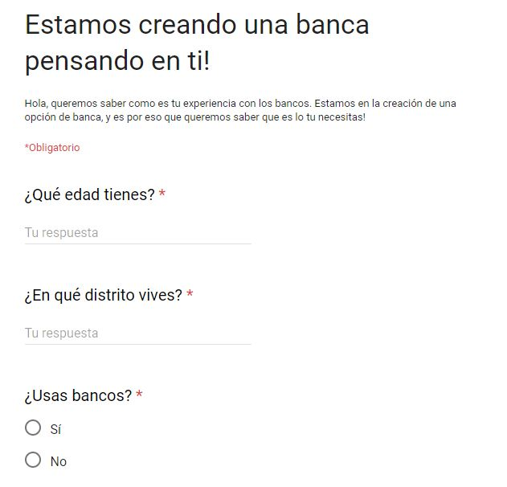
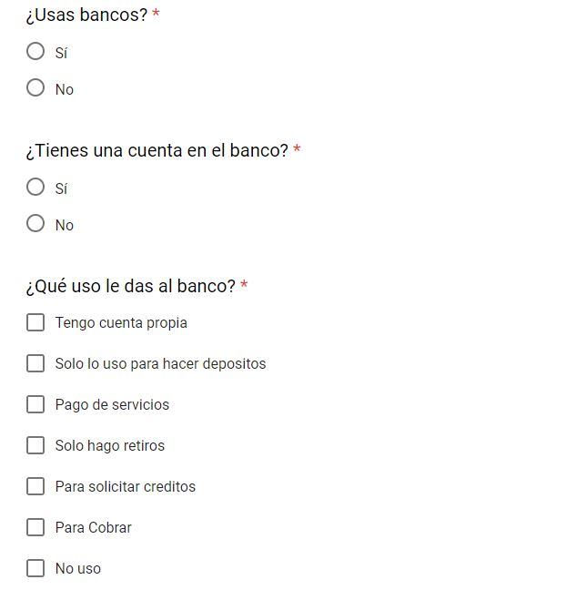
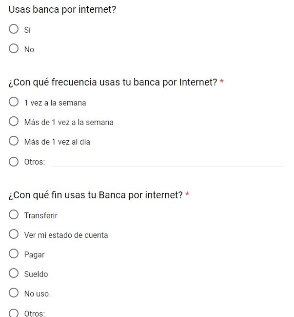
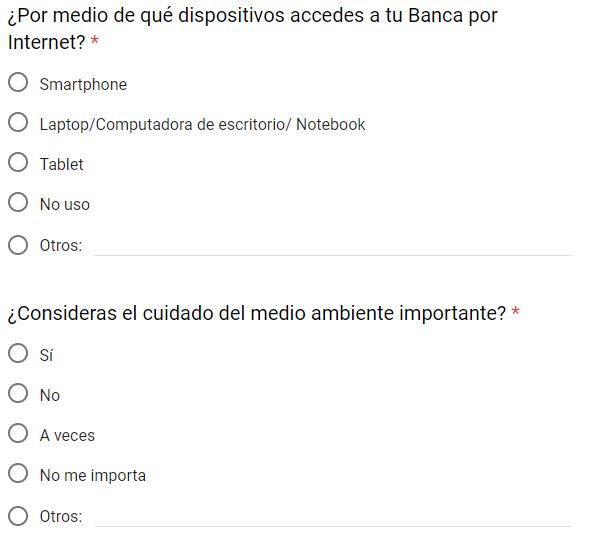
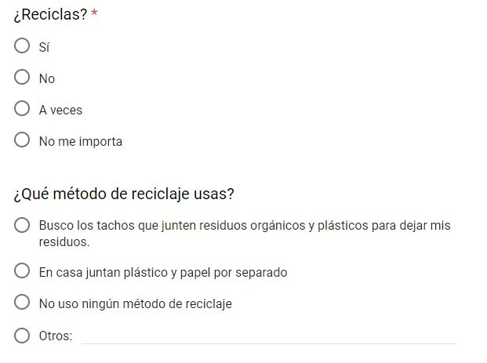

#### Resultados

[Carpeta de entrevistas personales](https://drive.google.com/drive/folders/1tgTpDQuvlQjGgaasxAcW8MTGvARl99aQ?usp=sharing).

[Carpeta de resultados de formularios](https://drive.google.com/drive/folders/1lvlHZIKZDOm6Gxey7Z40HbXbGXOQjDVS?usp=sharing).

#### Mapa de afinidad

El mapa de afinidad es una técnica utilizada para encontrar el problema, situación o cuestión a resolver.

Este es nuestro mapa de afinidad según lo encontrado en las entrevistas y formularios:

[Mapa de afinidad](https://drive.google.com/file/d/1jiy90GncHccfkQk8_DTNjBkGGpKVJavH/view?usp=sharing).

#### User Persona

Para crear una mejor experiencia, se decidió armar un user persona el cual se basó en la data anteriormente mostrada.

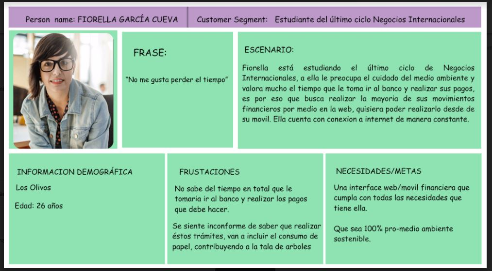

#### Story Board

#### Prototipo en papel 

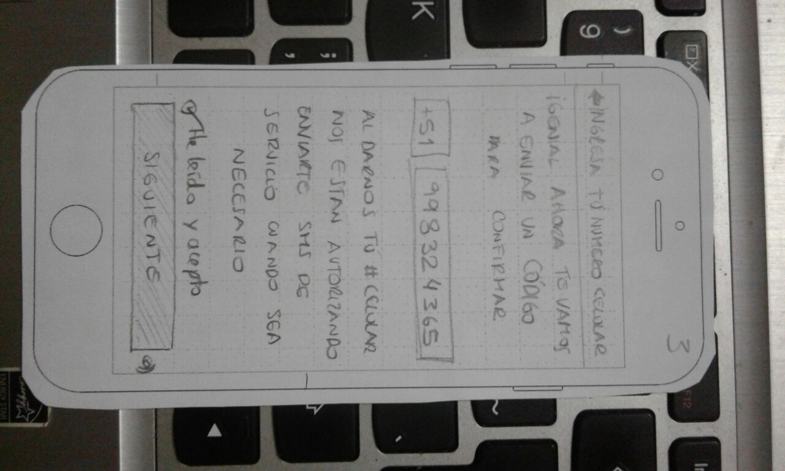

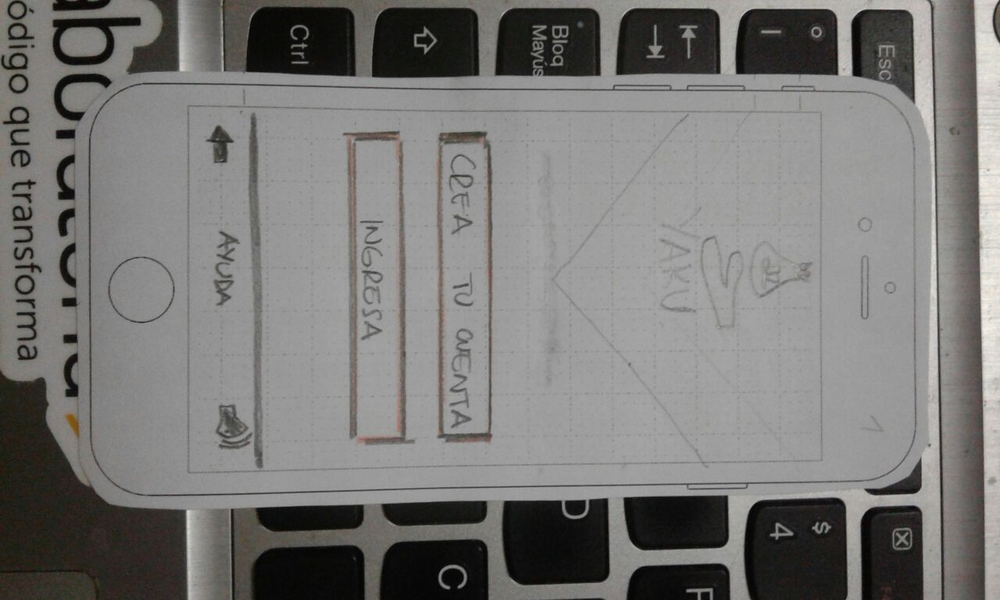
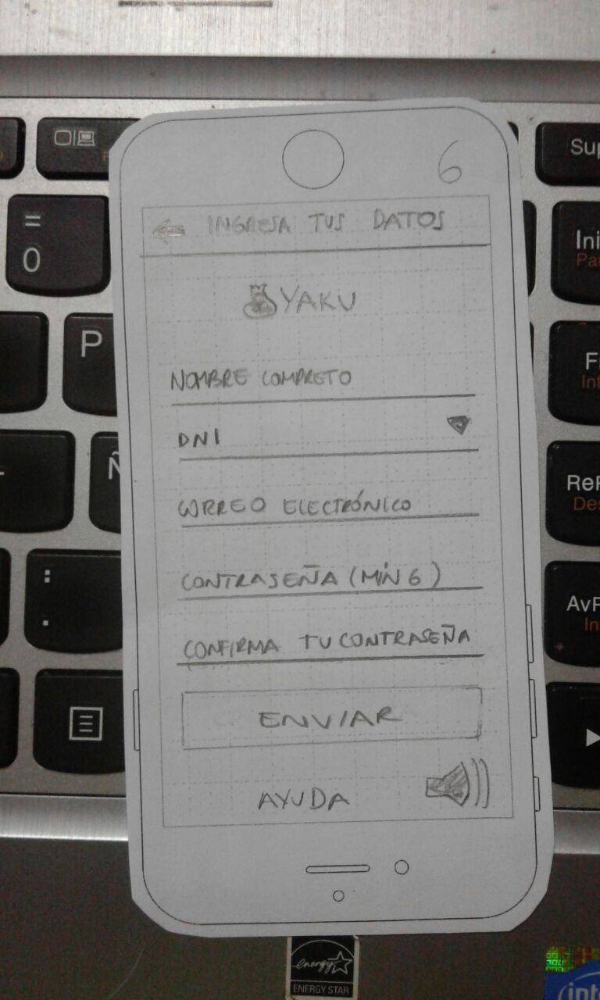

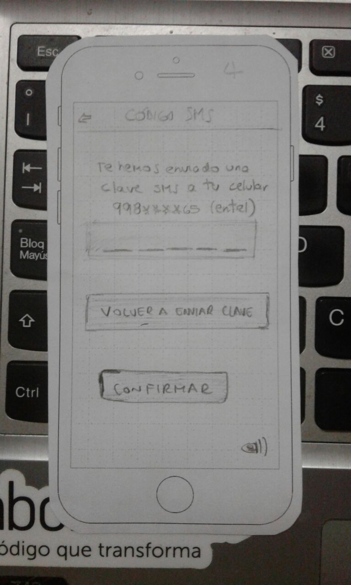
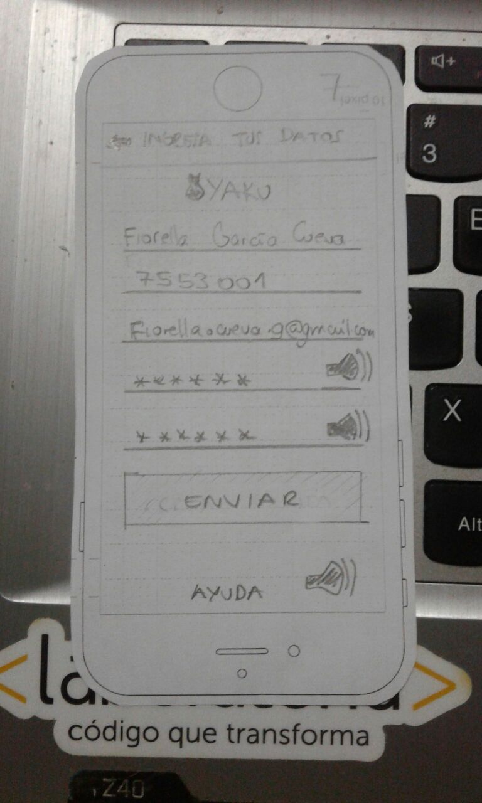
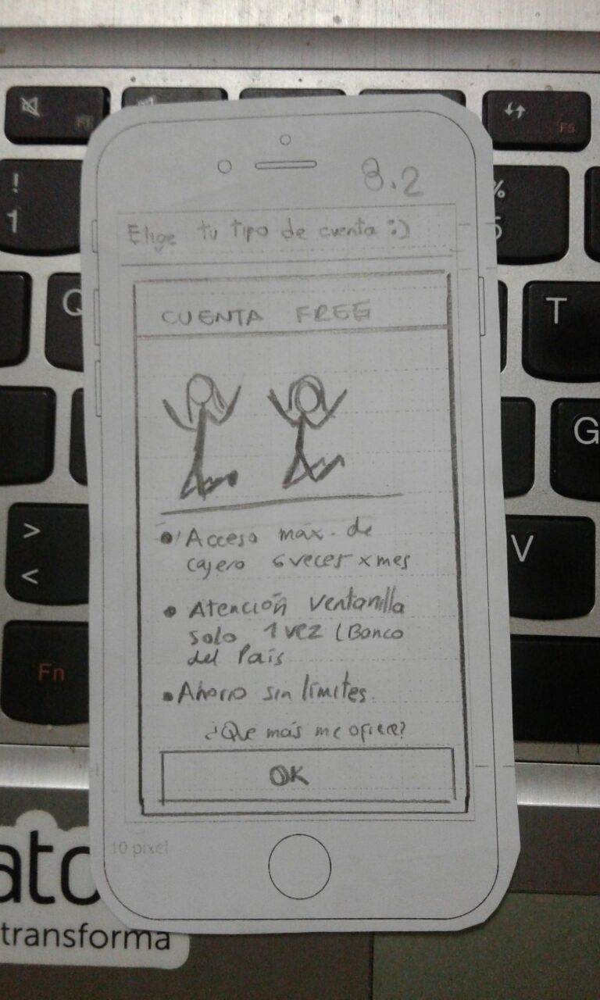

## Proceso de Ideación ##

¿ Cómo hicimos el Prototipo de Contenido ?

    1.-  Elaboración de propuestas de : Statements / Hmw  / What If / Features

    - Técnica: Elaboración de cuadro
    - Responsabilidad y participación:  
      Silvia Puente de la Vega Vilca
      Alexandra Calderon

    - Fecha :19/02/2018 a 21/02/2018
    - Tiempo:60 min c/u.

    2.-  Conversación interna  sobre propuestas:

    - Técnica: Conversación entre las dos
    - Responsabilidad y participación:  
      Silvia Puente de la Vega Vilca
      Alexandra Calderon
    - Fecha : 23/02/2018 
    - Tiempo: 10 min c/u.

    3.- Elaboración y propuesta de Prototipo de contenido

    - Técnica 1: Escribir posibles notas
    - Técnica 2: Conversación en remoto
    - Responsabilidad y participación:
      Silvia Puente de la Vega Vilca
      Alexandra Calderon
    - Fecha :24/02/2018 
    - Tiempo:30 min.

    4.- Propuesta de prototipo de contenido  a otro grupo para recibir feedback

    - Técnica 1:Exposición verbal directa una a una.
    - Técnica 2:Toma de notas
    - Responsabilidad y participación:  
      Silvia Puente de la Vega Vilca
      Alexandra Calderon
    - Fecha :26/02/2018 
    -  Tiempo:30 min.

    5.- Coordinación para conclusiones de prototipo de contenido  en grupo : 
    - Técnica: Reunión 
    - Responsabilidad y participación: 	
      Silvia Puente de la Vega Vilca
      Alexandra Calderon
    - Fecha:27/02/2018 Viernes
    - Tiempo:30 min.

    6.- Actualización del cuadro de Exploración Brainstorming con técnicas : ( Statements-HMW-What if – Features )

    - Técnicas:Recopilación y revisión de diapositivas de clase.
    - Actividad: Integración y actualización de cuadro: 
      statements/hmw/what if/features  incluyendo actualizaciones según coordinaciones realizadas en grupo y el proceso guía de clase y los aportes de todas las integrantes del grupo y el propio.

    - Responsable de elaboración:
      Silvia Puente de la Vega Vilca
      Alexandra Calderon
    - Responsables de revisión:
      Gonzalo (Teacher)
      Silvia Puente de la Vega Vilca
      Alexandra Calderon
    - Fecha : 28/02/2018 
    - Tiempo: 40 min.
    - Archivo:Brainstorming_Statements - HMW - What if – Features.xlsx

Ubicación archivo  ( link ):

[Documento](https://drive.google.com/drive/folders/1pyEdGdqwjObc9B4u9gvfbmUwkplPOdyK).

## Affinity map 
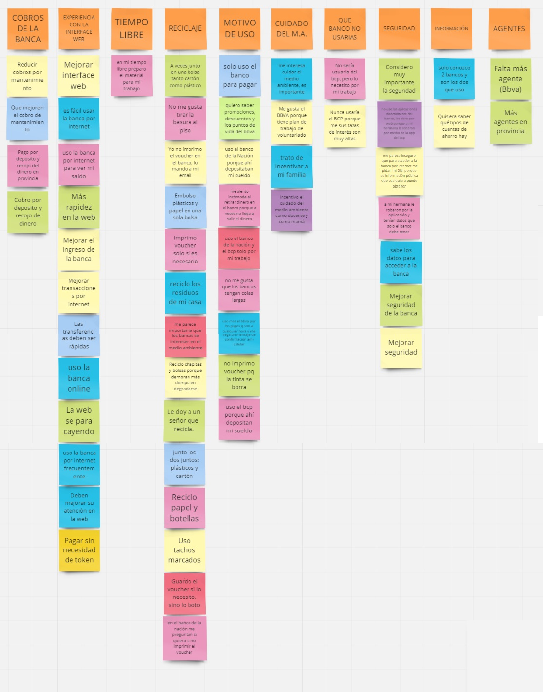

## Conceptualizacion del proceso 
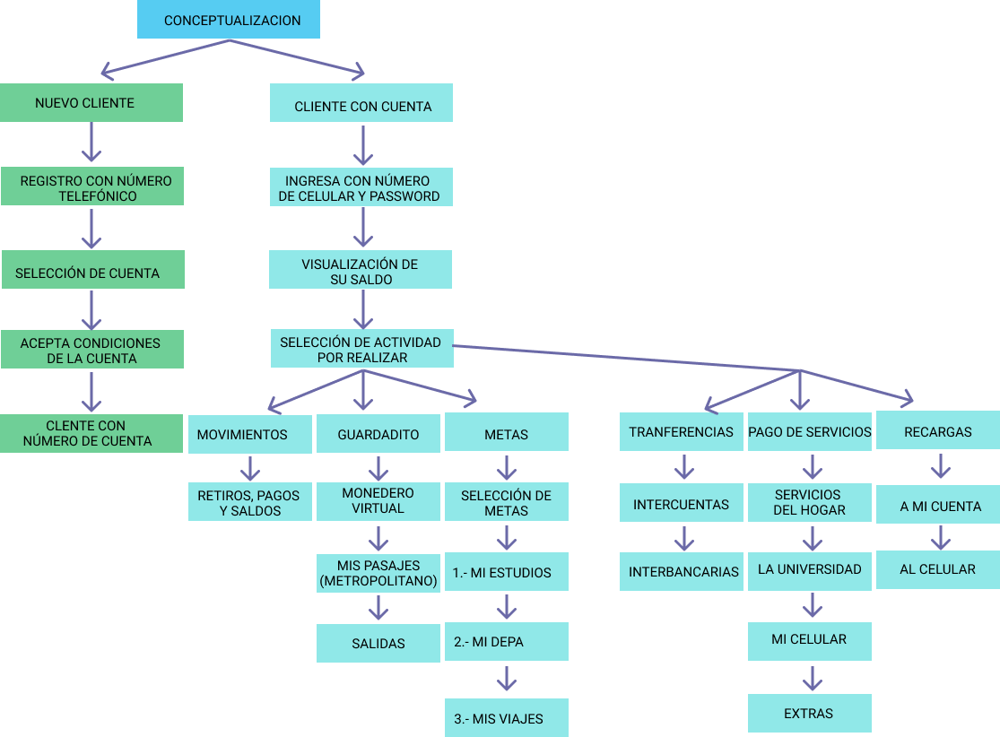

